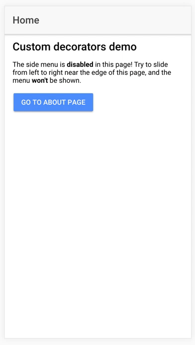

# Custom Decorators [](https://github.com/ellerbrock/open-source-badges/)

Ionic 2/3 demo of a custom decorator that disables the side menu in a particular page.

<p>
  
</p>

## Ionic info

```
Cli packages: (/usr/local/lib/node_modules)

    @ionic/cli-utils  : 1.19.0
    ionic (Ionic CLI) : 3.19.0

Global packages:

    cordova (Cordova CLI) : 7.1.0

Local packages:

    @ionic/app-scripts : 3.1.6
    Cordova Platforms  : android 6.3.0 ios 4.5.4
    Ionic Framework    : ionic-angular 3.9.2

System:

    Android SDK Tools : 25.2.5
    ios-deploy        : 1.9.2
    ios-sim           : 5.0.8
    Node              : v6.9.2
    npm               : 4.2.0
    OS                : macOS Sierra
    Xcode             : Xcode 9.2 Build version 9C40b

```

## Running the demo

Inside of the project folder, run `npm install` and then to run the demo in the browser `ionic serve [-t android/ios]`


## About the demo

The idea of the demo is to show how we could use custom decorators to do simple things that usually are needed in several pages, without repeating the same code over and over again.

In this particular demo we use a custom decorator to disable the side menu in a particular page, and then enable it when leaving that page

## Using the decorator in your projects

The first step is to go to the `app.module.ts` file and replace the following line:

```
export class AppModule {}
```

by this:

```
export class AppModule {

  static injector: Injector;

  constructor(injector: Injector) {
    // Make the injector to be available in the entire module
    AppModule.injector = injector;
  }
}
```

(remember to add the `Injector` in the imports `import { Injector } from '@angular/core';`)

Now we can write the code of the custom decorator, like this:

```
// Angular
import { AppModule } from "../app.module";

// Ionic
import { MenuController } from "ionic-angular";

export function DisableSideMenu() {

    return function (constructor) {
        const originalDidEnter = constructor.prototype.ionViewDidEnter;
        const originalDidLeave = constructor.prototype.ionViewDidLeave;

        constructor.prototype.ionViewDidEnter = function () {

            const menuCtrl = AppModule.injector.get(MenuController);

            // Disable the side menu when entering in the page
            menuCtrl.enable(false);

            console.log('Disabling side menu...');

            // Call the ionViewDidEnter event defined in the page
            originalDidEnter && typeof originalDidEnter === 'function' && originalDidEnter.apply(this, arguments);
        };

        constructor.prototype.ionViewDidLeave = function () {

            const menuCtrl = AppModule.injector.get(MenuController);

            // Enable the side menu when leaving the page
            menuCtrl.enable(true);

            console.log('Enabling side menu...');

            // Call the ionViewDidEnter event defined in the page
            originalDidLeave && typeof originalDidLeave === 'function' && originalDidLeave.apply(this, arguments);
        };
    }

}
```

And the last step is just to use it wherever we need it, like this:

```
import { Component } from '@angular/core';
import { DisableSideMenu } from '../../app/custom-decorators/disable-side-menu.decorator';

@DisableSideMenu()
@Component({
  selector: 'page-home',
  templateUrl: 'home.html'
})
export class HomePage {

  constructor() {}

}
```

## Support this project
If you find this project useful, please star the repo to let people know that it's reliable. Also, share it with friends and colleagues that might find this useful as well. Thank you! :)